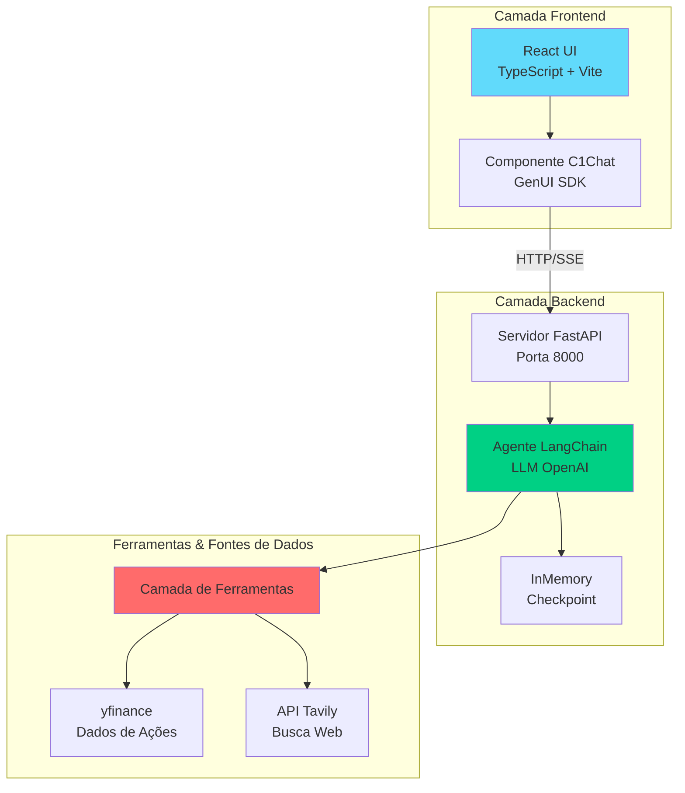
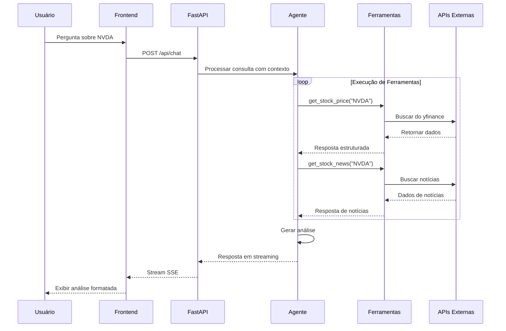

# 📊 Nexus Financial Analyst

> **Assistente de Análise Financeira com IA** - Uma plataforma abrangente que combina agentes LangChain com dados de mercado em tempo real para fornecer análises profissionais de ações, briefings de mercado e análises comparativas.

[🇺🇸 English Version](./README.md)

## 🎯 Visão Geral

Nexus Financial Analyst é uma plataforma inteligente de análise financeira que utiliza agentes de IA para fornecer:
- **Stock Analyzer**: Análise profunda de ações individuais com dados históricos, financeiros e notícias
- **Market Pulse**: Briefings pré-mercado e intradiários com principais movimentações e tendências macro
- **Stock Showdown**: Análise comparativa lado a lado de múltiplos ativos

O sistema usa agentes LangChain com ferramentas especializadas para buscar dados em tempo real do yfinance e Tavily, fornecendo insights baseados em dados com respostas conscientes de conformidade.

## 🏗️ Arquitetura



## 🔄 Fluxo de Dados



## ✨ Funcionalidades

### 🔍 Stock Analyzer
- Snapshots de preço em tempo real e capitalização de mercado
- Gráficos de preço histórico de 1 ano
- Balanço patrimonial e principais métricas financeiras
- Fatos da empresa e informações do setor
- Feed de notícias dos últimos 7 dias com citações de fontes
- Análise multidimensional (Crescimento, Lucratividade, Avaliação, Risco)

### 📈 Market Pulse
- Monitoramento de watchlist com snapshots de preço
- Identificação dos principais movimentadores por setor
- Manchetes macro e implicações de mercado
- Briefings pré-mercado e intradiários
- Visualização de desempenho por setor

### ⚔️ Stock Showdown
- Comparação lado a lado de 2-4 tickers
- Análise de retornos indexados (1 ano e 5 anos)
- Métricas comparativas (avaliação, crescimento, lucratividade)
- Comparação de alavancagem e liquidez
- Identificação de notícias e catalisadores

### 🛡️ Conformidade & Segurança
- Tom profissional, neutro e baseado em dados
- Disclaimers "Não é aconselhamento financeiro"
- Citações de fontes com publicador e data
- Transparência sobre limitações de dados
- Perguntas de acompanhamento para guiar análises mais profundas

## 🛠️ Stack Tecnológico

### Backend
- **Framework**: FastAPI
- **IA/ML**: LangChain, LangGraph, API OpenAI
- **Fontes de Dados**: yfinance (dados de mercado), Tavily (busca web)
- **Linguagem**: Python 3.13+
- **Gerenciador de Pacotes**: uv / pip

### Frontend
- **Framework**: React 19 + TypeScript
- **Ferramenta de Build**: Vite
- **Biblioteca de UI**: GenUI SDK (@thesysai/genui-sdk)
- **Estilização**: Crayon UI, TailwindCSS, SASS
- **Linting**: ESLint com suporte TypeScript

## 📋 Pré-requisitos

- **Node.js** 18+ (para frontend)
- **Python** 3.13+ (para backend)
- **Chave API OpenAI** ou endpoint LLM compatível
- **Chave API Tavily** (para funcionalidade de busca web)

## 🚀 Instalação e Configuração

### 1. Clonar o Repositório

```bash
git clone https://github.com/andrecodea/nexus-financial-analyst.git
cd nexus-financial-analyst
```

### 2. Configuração do Backend

```bash
cd backend

# Criar ambiente virtual
python -m venv .venv

# Ativar ambiente virtual
# Windows (PowerShell):
.venv\Scripts\Activate.ps1
# Windows (CMD):
.venv\Scripts\activate
# macOS/Linux:
source .venv/bin/activate

# Instalar dependências
pip install -r requirements.txt
# OU usando o pyproject.toml do projeto:
pip install .
```

### 3. Configuração de Ambiente

Crie um arquivo `.env` no diretório `backend`:

```bash
# Copiar arquivo de exemplo
cp ../.env.example backend/.env

# Editar backend/.env com suas chaves de API
```

Variáveis de ambiente necessárias:
```env
LLM_NAME=gpt-4o-mini                    # ou seu modelo preferido
LLM_BASE_URL=https://api.openai.com/v1  # OpenAI ou endpoint compatível
OPENAI_API_KEY=sua-chave-openai-aqui
TAVILY_API_KEY=sua-chave-tavily-aqui
```

### 4. Configuração do Frontend

```bash
cd frontend

# Instalar dependências
npm install

# Iniciar servidor de desenvolvimento
npm run dev
```

### 5. Executar a Aplicação

**Terminal 1 - Backend:**
```bash
cd backend
uvicorn main:app --reload --port 8000
```

**Terminal 2 - Frontend:**
```bash
cd frontend
npm run dev
```

Acesse a aplicação em `http://localhost:5173` (ou a porta exibida pelo Vite)

## 🔧 Ferramentas Disponíveis

O agente tem acesso a estas ferramentas especializadas:

| Ferramenta | Descrição | Parâmetros |
|------------|-----------|------------|
| `get_stock_price` | Preço de ação em tempo real | `ticker` (ex: "NVDA") |
| `get_historical_stock_price` | Dados de preço histórico | `ticker`, `start_date`, `end_date` |
| `get_balance_sheet` | Balanço patrimonial da empresa | `ticker` |
| `get_stock_news` | Notícias mais recentes da ação | `ticker` |
| `web_search` | Busca web via Tavily | `query` |

## 📝 Endpoints da API

### POST `/api/chat`

Transmite respostas em streaming do agente financeiro.

**Corpo da Requisição:**
```json
{
  "message": "Analise a ação NVDA",
  "thread_id": "id-de-sessão-opcional"
}
```

**Resposta:** Stream de Server-Sent Events (SSE) com respostas do agente

## 🐛 Solução de Problemas

### Problemas no Backend

**Problema: `ModuleNotFoundError: No module named 'langchain'`**
```bash
# Certifique-se de que o ambiente virtual está ativado
source .venv/bin/activate  # ou .venv\Scripts\activate no Windows
pip install -r requirements.txt
```

**Problema: `OpenAI API key not found`**
```bash
# Verifique se o arquivo .env existe no diretório backend
# Confirme que OPENAI_API_KEY está definida
cat backend/.env | grep OPENAI_API_KEY
```

### Problemas no Frontend

**Problema: Porta já em uso**
```bash
# Mude a porta em vite.config.ts ou encerre o processo na porta 5173
# Linux/Mac:
lsof -ti:5173 | xargs kill -9
# Windows:
netstat -ano | findstr :5173
taskkill /PID <PID> /F
```

**Problema: Erros de CORS**
- Certifique-se de que o backend está rodando na porta 8000
- Verifique a configuração do middleware CORS em `backend/main.py`

## 🔒 Notas de Segurança

⚠️ **Informações Importantes de Segurança:**

- **Nunca comite** arquivos `.env` ou arquivos contendo segredos
- O histórico do repositório foi previamente reescrito para remover chaves expostas
- **Você DEVE rotacionar quaisquer chaves de API** que possam ter sido expostas
- Após a reescrita do histórico, colaboradores devem clonar novamente:
  ```bash
  git clone https://github.com/andrecodea/nexus-financial-analyst.git
  ```
- Use `backend/.env.example` como modelo para variáveis de ambiente
- Arquivos `.env` já estão em `.gitignore` (já configurado)

## 🤝 Contribuindo

1. Faça fork do repositório
2. Crie uma branch de feature (`git checkout -b feature/funcionalidade-incrivel`)
3. Commit suas mudanças (`git commit -m 'Adiciona funcionalidade incrível'`)
4. Push para a branch (`git push origin feature/funcionalidade-incrivel`)
5. Abra um Pull Request

### Diretrizes de Desenvolvimento

- Siga o estilo de código e convenções existentes
- Adicione testes para novas funcionalidades
- Atualize a documentação conforme necessário
- Certifique-se de que o linting passa: `npm run lint` (frontend) / siga PEP 8 (backend)
- Teste minuciosamente antes de submeter PR

## 📄 Licença

Este projeto é fornecido como está para fins educacionais e de desenvolvimento.

## 🙏 Agradecimentos

- [LangChain](https://python.langchain.com/) - Framework de agentes
- [yfinance](https://github.com/ranaroussi/yfinance) - Dados de mercado
- [Tavily](https://tavily.com/) - API de busca web
- [FastAPI](https://fastapi.tiangolo.com/) - Framework backend
- [React](https://react.dev/) - Biblioteca frontend
- [GenUI SDK](https://github.com/thesysai/genui-sdk) - Interface de chat

---

**Aviso Legal**: Isto não é aconselhamento financeiro. Esta ferramenta é apenas para fins informativos e educacionais. Sempre conduza sua própria pesquisa e consulte consultores financeiros qualificados antes de tomar decisões de investimento.
